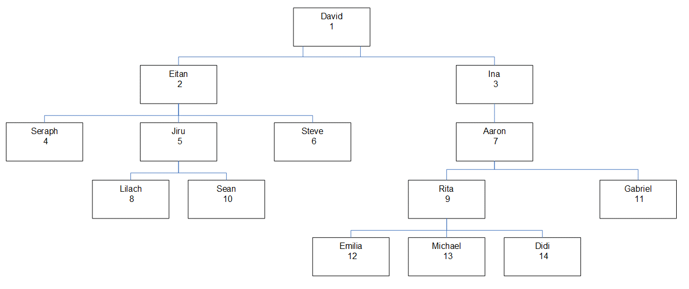
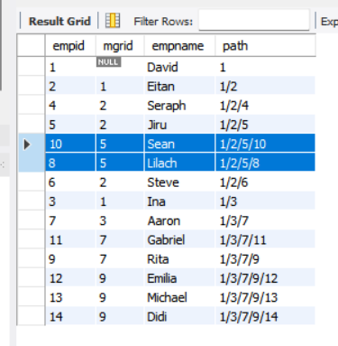
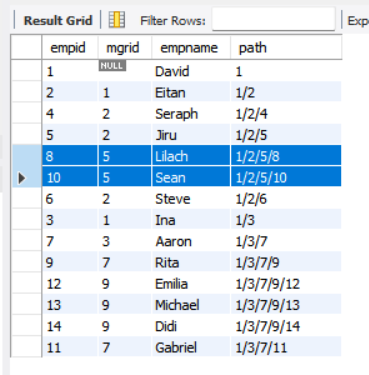

# 240626

✅ 파일트리를 DFS/BFS 순회한다면, DB 쿼리를 어떻게 날려봐야 할지에 대해 탐구(?)

+) 데이터 및 코드 참고 : https://sqlperformance.com/2020/09/t-sql-queries/fundamentals-of-table-expressions-part-6-recursive-ctes

### ✨ 진행 과정



이러한 이진탐색트리 구조의 트리를, SQL 쿼리로 DFS/BFS 순회하려면 어떻게 해야 할까 에 대해 고민해보았다.

SQL의 `WITH RECURSIVE`를 써서 DFS로 탐색되도록 하고 싶었는데, 이게 DFS로 계속 안 되고 자꾸 BFS 방식으로 select 되었다..

따라서 DFS로 탐색되도록 하기 위해 path 라는 정보를 두어 '1/2/5/10' 이런 식으로 루트 노드부터 현재 노드까지 어떻게 방문할 수 있는지를 varchar로 담았다.

```
CONCAT(M.path, '/', S.empid) AS path,
```

이랬더니, `1/2/5/10`과 `1/2/5/8`이 있을 때 `1/2/5/10`이 더 먼저 나오게 되는 문제가 있었다.




(물론 이렇게 되더라도 같은 계층에서 뭘 선택했냐의 문제이지, DFS라고 볼 수 있다고 생각한다.)

이번에는 더 원하는 결과대로 만들기 위해, 

LPAD 함수를 사용하여 empid를 고정된 길이의 문자열로 변환한 후, 경로를 생성하고, 이 경로를 기준으로 정렬하는 sorted_path를 두었다.

- "1/2/5/8"는 "00001/00002/00005/00008"로 변환
- "1/2/5/10"는 "00001/00002/00005/00010"로 변환

```
 CONCAT(M.sorted_path, '/', LPAD(S.empid, 5, '0')) AS sorted_path -- 경로 갱신
```

그랬더니 이제 원하는대로 DFS가 잘 진행되었다.



원래 이 path와 sorted_path를 안 쓰고도 그냥 재귀로 DFS를 구현하고 싶었는데,

알고보니 MySQL 쿼리는 재귀가 BFS 방식으로 작동한다고 한다..

그래서 지저분하지만.. 아래 sql문으로 DFS를 마무리했다.

```
WITH RECURSIVE FileTree AS (
    SELECT
        empid,
        mgrid,
        empname,
        CAST(empid AS CHAR(200)) AS path,
        CAST(LPAD(empid, 5, '0') AS CHAR(200)) AS sorted_path -- 정렬을 위한 패딩 경로 추가
    FROM Employees
    WHERE empid = 1 -- 루트 노드에서 시작
    UNION ALL
    SELECT
        S.empid,
        S.mgrid,
        S.empname,
        CONCAT(M.path, '/', S.empid) AS path,
        CONCAT(M.sorted_path, '/', LPAD(S.empid, 5, '0')) AS sorted_path -- 경로 갱신
    FROM FileTree AS M
    INNER JOIN Employees AS S
        ON S.mgrid = M.empid
)
SELECT empid, mgrid, empname, path
FROM FileTree
ORDER BY sorted_path; -- 패딩된 경로 기준으로 결과 정렬
```

BFS의 경우에는 path, sorted_path 안 쓴 그게 그냥 BFS로 동작해서.. 저 부분만 없앴다!
```
WITH RECURSIVE FileTree AS (
    SELECT
        empid,
        mgrid,
        empname
    FROM Employees
    WHERE empid = 1 -- 루트 노드에서 시작
    UNION ALL
    SELECT
        S.empid,
        S.mgrid,
        S.empname
    FROM FileTree AS M
    INNER JOIN Employees AS S
        ON S.mgrid = M.empid
)
SELECT empid, mgrid, empname
FROM FileTree;
```


+) 그리고 참고로, WITH RECURSIVE 는 mysql 8.0 이상부터 가능하다고 한다.
